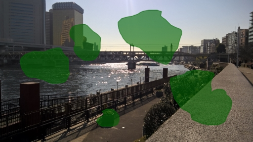

# smudge.js
Plugin for drawing / marking interesting spots on images.



##How to use
Add the image path into the data-image-url attribute. The plugin appends the image to the element (with a transparent canvas element over it).
```html
<div class="image-container" data-image-url="img/river.jpg">
  <!-- image canvas gets appended here -->
</div>
```
Run the plugin on all elements with a class of image-container.
```js
var smudge = new Smudge('.image-container');
```

Get the data of the shapes.
```js
smudge.shapes;
```

Available settings.
```js
var smudge = new Smudge('.image-container'{
  fillColor: 'rgba(255, 255, 255, 0.4)',
  borderColor: '#934',
  annotation: true // enable annotation of drawn shapes by opening a input modal on double click
});
```
